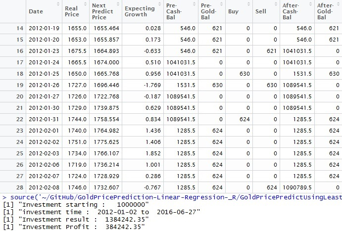
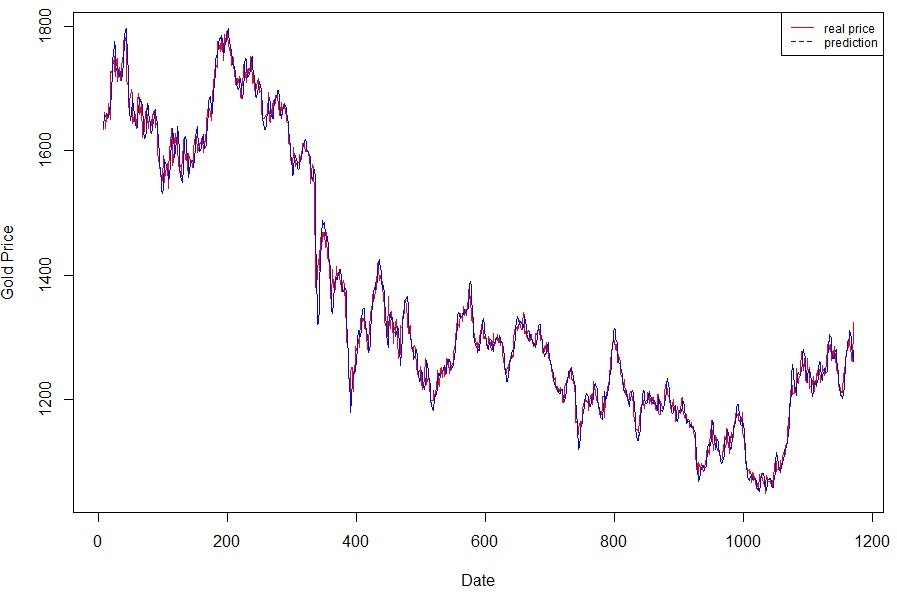

<b><a href="https://github.com/taigi0315/GoldPricePrediction-Linear-Regression-_R" target="_blank">Git Repo Link</a></b>

# About Project

Project uses gold price data from Quandl 
Script grabs certain days of gold price(controlled by windows size parameter), and predicts next day gold price using linear regression algorithm 
Using Greedy algorithm, script decide selling the gold it is holding, or purchase gold with cash balance it has.
Script runs certain period of time, and return the result of trading.

***

# Parameters

<ui>
<li>winLen = number of days that will be used for prediction</li>
<li>cashBalance = starting balance in USD</li>
<li>goldBalance = starting gold balance</li>
<li>cashRate = percentage of investment (1 = invest 100% of cash balance)</li>
<li>growthRate = threshold of price growth for decision making</li>
</ui>

***

