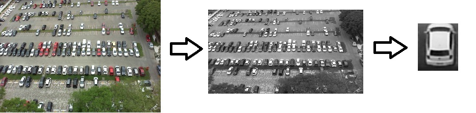

<b><a href="https://github.com/taigi0315/Parking-Lot-Classifier" target="_blank">Git Repo Link</a></b>

# About Project

Project uses parking lot image data(PKlot) from Federal University of Parana 
Script gray scale the original image and crop specific lot area out of whole image. 
Logistic model is trained using 10 fold cross validation. 
Script returns predicted value from 0 to 1. 
Using threshold(0.5) we can convert predicted value to 0(empty lot) or 1(car in lot) 

***

