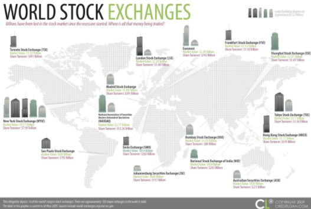
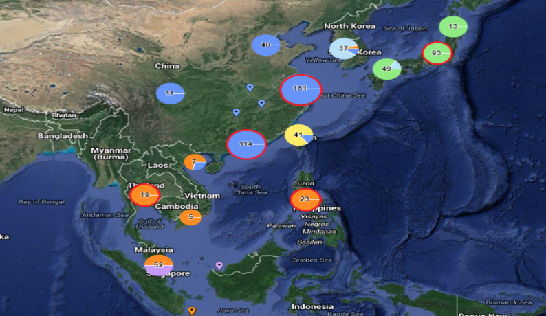
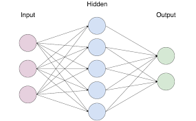
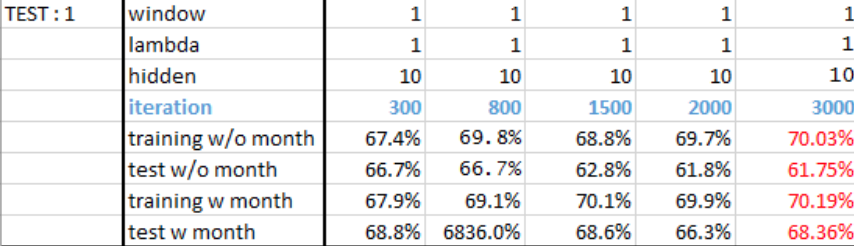
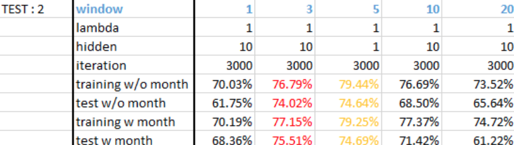
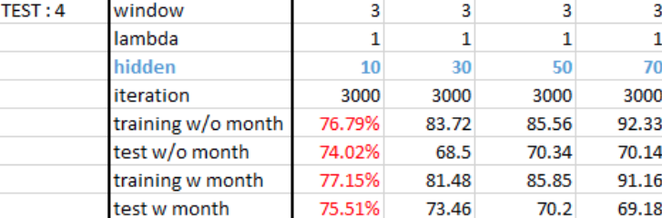
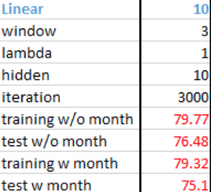

## Intro

Predicting stock market price is one of the most attractive prediction problems. 
The fact is the stock prices are measured by needs and support which means it is decided by personal decision. 
This is why predicting stock prices has been and remains unsolved.

***

<figure class="half">

</figure>

***

## Data

Project uses variety of data that is related with target stock price(Apple Inc) in many perspectives. 
Project assumes that our target stock price has a connection with global economic data. 
Data is accumulated from Quandl, USA government, and Yahoo finance. 
* Index Data
* Community Data
* Currency Data

### Index Data
<ul>
<li>SwissMarket</li>
<li>STI</li>
<li>SP500 </li>
<li>Russell1000</li>
<li>NASDAQ</li>
<li>Kospi</li>
<li>CAC40</li>
<li>ATX</li>
<li>Nikkei225</li>
<li>Treasury 5 year</li>
<li>Treasury 30 year</li>
</ul>

### Commmodity Data
<ul>
<li>Gold price in USD</li>
<li>Silver price in USD</li>
<li>Oil price in USD</li>
</ul>

### Currency Data

 Apple Global Supply 

<ul>
<li>Europe Euro to USD</li>
<li>China Yen to USD</li>
<li>Korea Won to USD</li>
<li>Colombian Peso to USD</li>
<li>Japanese Yen to USD</li>
<li>Malaysian Ringgit to USD</li>
<li>Thai Baht to USD</li>
</ul>

### Others
<ul>
<li>Window size</li>
<li>Month</li>
<li>Other Stocks in S&P500 which has high or low Z-Score with Apple stock</li>
</ul>

S&P500 Relationship based on Z-Score

***

## Model

<b>Neural Network</b>

-Input : today’s feature values 
-Output : tomorrow’s target price in 2 classes(positive / negative) 

	

***

## Result

 Accuracy with different iteration 

 Accuracy with different window size 

 Accuracy with different size of hidden layer

***

## Conclusion

&nbsp; The highest accuracy I found in multiple experiments was 76.48%  
&nbsp; Add ‘Month columns’ actually increase performance of program in most of experiment 
&nbsp; Neural network is really strong but it also needs a lot of experiments to achieve its best performance 

 
 