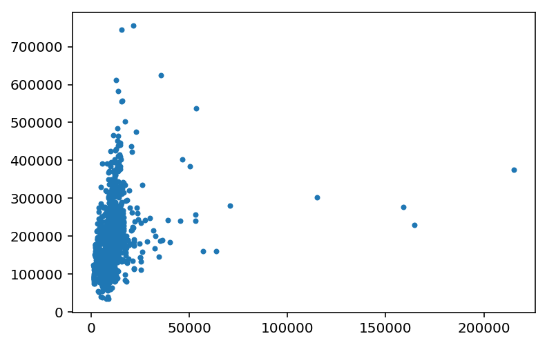
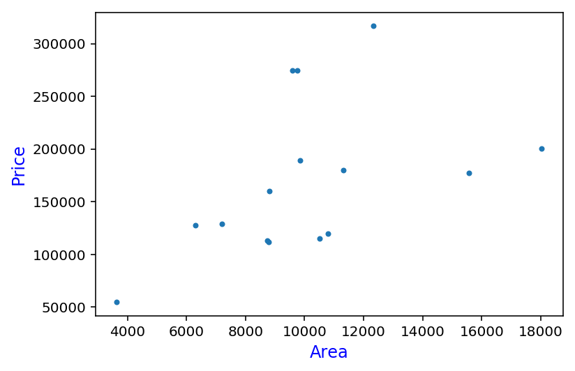
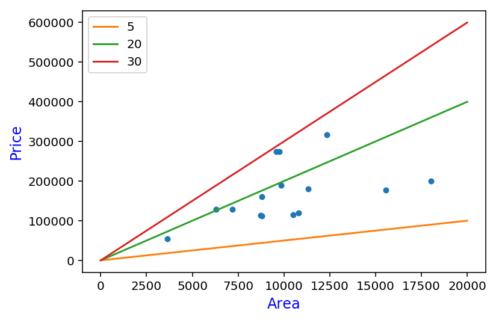
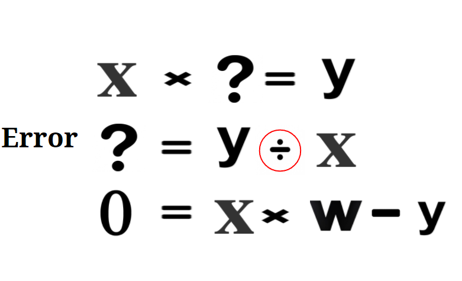
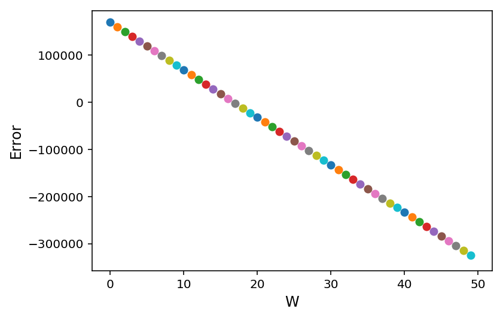
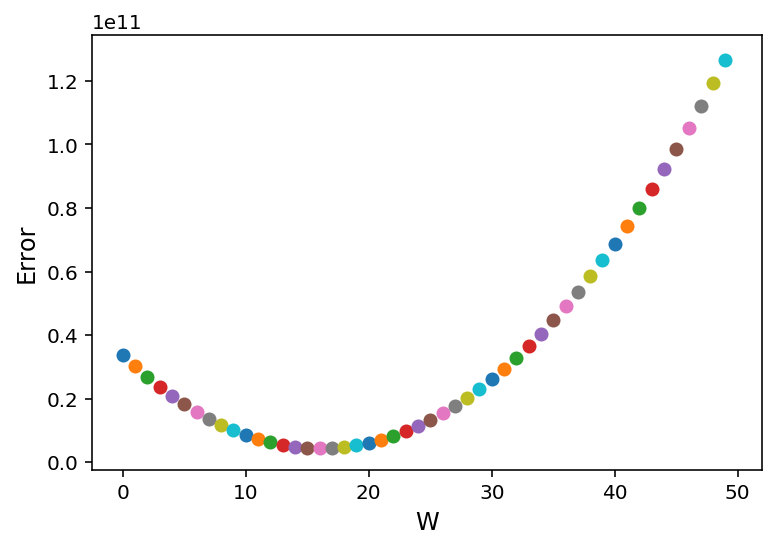

<center><b><a href="https://github.com/taigi0315/chois-ml-note" target="_blank"><font size="4">Git Repo Link</font></a></b></center>

In this post, I am going to give you a simple description of how machine learning work.<br />
<b>You won't need <font color='red'>Any</font> background knowledge!</b>

***

## Let's start with loading all libraries we need.<br />
(numpy, pandas, matplotlib these three libraries are extreamly strong and useful libraries!)

```python
import numpy as np
import pandas as pd
import matplotlib.pyplot as plt
%matplotlib inline
%config InlineBackend.figure_format = 'retina'
```
Read csv file using pandas.

```python
house_price = pd.read_csv('data/house_price_train.csv')
house_price = house_price[['LotArea', 'SalePrice']]
plt.plot(house_price['LotArea'], house_price['SalePrice'], '.')
```
Quick look at dataset(Lot area - Price)


For this tutorial, we are going to randomly choose 15 data points(houses).

```python
sample_data = house_price.sample(15, random_state=3)
plt.plot(sample_data['LotArea'], sample_data['SalePrice'], '.')
plt.xlabel('Area', fontsize=12, color='blue')
plt.ylabel('Price', fontsize=12, color='blue')
```



***

## <b>Not a machine learning question!</b><br />
If I ask you to draw a **LINE** which can represent the data points best, how would you draw?<br />
You might want to draw it going through middle of all data points, which totaly makes sense!<br />
How did you come up with that?! 

```python
def graph(formula, x_range):
    x = np.array(x_range)
    y = eval(formula)
    plt.plot(x, y)

plt.plot(sample_data['LotArea'], sample_data['SalePrice'], '.', markersize=8, label='_nolegend_')
plt.xlabel('Area', fontsize=12, color='blue')
plt.ylabel('Price', fontsize=12, color='blue')
graph('5*x', range(0, 20000))
graph('20*x', range(0, 20000))
graph('30*x', range(0, 20000))
plt.legend(['5', '20', '30'])
```


<figcaption>3 lines represent 3 different prediction models<br />
Simply we can tell green line is the best line to represent the data points.</figcaption>
We know **'Drawing the line throuh middle of all data points'** gives smallest error(Sum of errors) in a instinct!

---

# What we are trying to do in Machine Learning
If we know the 'W'(relationship), we can easily predict 'y'(price) value when we have 'X'(Lot area) value.<br />
problem is multiplication does not have inverse function.(division doesn't actually works as inverse of multiplication in this case)
so we move y value to the right side and try to keep the left side close to 0.<br />
this process is called **Training** in machine learning.<br />
Simply, <b><font color="red">model starts with random W(relationship) and compare it's result(W * X = y_predict) with actual value(y) then modify W.</font></b>

<figure class="half">
	
	
</figure>

---

## Let's check it from our data points
```python
# Check the error based on W
plt.xlabel('W', fontsize=12)
plt.ylabel('Error', fontsize=12)

for w in range(0, 50):
    predict = w * sample_data['LotArea']
    error = np.mean(sample_data['SalePrice'] - predict)
    plt.scatter(w, error)
```

this plot shows sum of errors on 15 house prices for each 'W' from 0 to 50
as you can see error starts from around 200k, hits zero, and goes down to -200k

## Hold on, Negative Error?
Negative error does not make sense, it happens when our prediction price is bigger than actual price.<br />
to solve this problem, simply we square the error, aka MSE(Mean Squared Error)


```python
# Check the squared error based on W
plt.xlabel('W', fontsize=12)
plt.ylabel('Error', fontsize=12)

for w in range(0, 50):
    predict = w * sample_data['LotArea']
    error = np.mean((sample_data['SalePrice'] - predict)**2)
    plt.scatter(w, error)
```



***

<font size="4"> Alright, Post got longer than I epected 😆<br />
Hope this post helped you understanding how machine learning works ! <br /></font>

---

