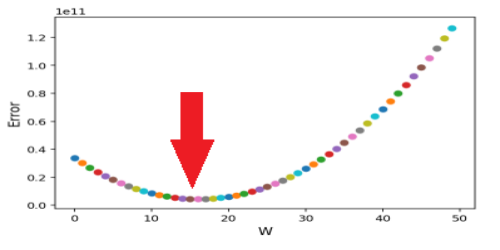
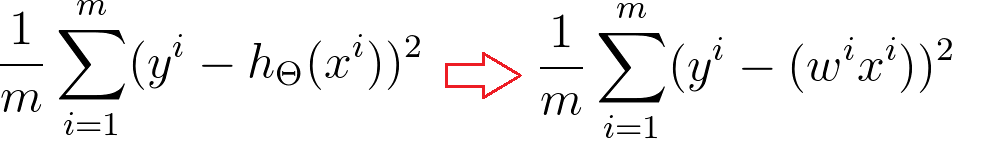

# How to find the best 'Weight'? Gradient Descent! 
In this post, I will talk about 'Gradient Descent', one of the most popular way to find best 'Wegith', with an example from the previous post.<br />
There are many different optimization algorithm, and you will need to study calculus to <b>fully</b> understand it.<br />
<b>Don't give up even though you don't understand this at once.</b>
(I have learned like 5 times, and still confusing 😧)

---
<figure class="half">
    

</figure>

Remember this parabolic graph we found?<br />
We can easily find the <b>best weight</b> with this grpah, <b>The bottom one !</b> right?<br />
But what if we have 9 features from each house?(number of living rooms, number of bath rooms, year of built and so on) Can we draw <b>10 dimensional graph</b>? The answer is <b>No</b>.<br />
This is why we are going to use <b>Gradient Descent</b> algorithm.<br />

<figcaption align="middle">X_1 will move to X_2,optimized weight, and so does X_3</figcaption>

The principle of Gradient Descent is pretty simple.<br />
Wherever the ‘Weight’ is initiated, <b>subtracting its derivative from itself</b> will move the weight where its error is smaller

---

## Let's check this in code with sample data set.

Load up all libraries and data.
```python
import numpy as np
import pandas as pd
import matplotlib.pyplot as plt
%matplotlib inline
%config InlineBackend.figure_format = 'retina'

house_price = pd.read_csv('data/house_price_train.csv')
house_price = house_price[['LotArea', 'SalePrice']]
sample_data = house_price.sample(15, random_state=3)
```

## We are going to use the sample data as we did previous [post](http://taigi0315/github.io/how-machinelearning-work-1/)


```python
sqft = sample_data['LotArea'].values 
price = sample_data['SalePrice'].values
#normalize the data 
sqft = sqft/np.linalg.norm(sqft, ord=1)
price = price/np.linalg.norm(price, ord=1)

weight = np.arange(-4,6,0.2)
error = np.zeros(len(weight))
for idx, w in enumerate(weight):
    error[idx] = np.mean((w*sqft - price)**2)
    
plt.subplot(2,1,1)
plt.plot(sqft, price, '.')
plt.xlabel('Area', fontsize=12, color='blue')
plt.ylabel('Price', fontsize=12, color='blue')

plt.subplot(2,1,2)
plt.plot(weight, error, '.')
plt.xlabel('W', fontsize=12)
plt.ylabel('Error', fontsize=12)

plt.show()
```


---

## Let's code Gradient Descent algorithm.
Using for loop, we are repeating
* Calculate prediction(weight x X)
* Calculate the error by comparing the prediction and actual y value(prediction - Y)
* Sum up the erros and calculate its derivative
* Move weight subtracting its derivative (new weight = weight - derivative) 

```python
iteration = 1000
weights = []
errors = []

weight = -4
for iter in range(iteration):
    error = 0
    for i in range(len(price)):
        error += (price[i] - (weight * sqft[i]))**2
    update = 0
    for i in range(len(price)):
        update += (2*(weight * sqft[i]) - price[i])*sqft[i]
    weight = weight - update/len(price)
    if(iter % 10 ==0):
        errors.append(error)
        weights.append(weight)
    if(iter % 100 ==0):
        print ("iteration : {} weight: {} error : {}".format(iter, weight, error))
```

    iteration : 0 weight: -3.9557392076392555 error : 1.8317052672770477
    iteration : 100 weight: -1.163805497824605 error : 0.3488113160444593
    iteration : 200 weight: -0.12965077609920414 error : 0.09868492381795531
    iteration : 300 weight: 0.25340845797478184 error : 0.04708003644318537
    iteration : 400 weight: 0.395296681977216 error : 0.0335964867179579
    iteration : 500 weight: 0.447853222375552 error : 0.029374699866994963
    iteration : 600 weight: 0.46732058802948007 error : 0.02791692230389369
    iteration : 700 weight: 0.47453145698377963 error : 0.027391494044862495
    iteration : 800 weight: 0.47720242089335146 error : 0.027198866694807304
    iteration : 900 weight: 0.4781917674272366 error : 0.02712778976144221
<figcaption><b>Error goes down by iteration</b></figcaption>

---

## Plotting the result 

```python
sqft = sqft/np.linalg.norm(sqft, ord=1)
price = price/np.linalg.norm(price, ord=1)

weight = np.arange(-4,6,0.2)
error = np.zeros(len(weight))
for idx, w in enumerate(weight):
    error[idx] = np.mean((w*sqft - price)**2)
plt.figure(figsize=(8,10))
plt.plot(weight, error, '.')
plt.ylim(-0.02, 0.6)
plt.xlabel('W', fontsize=12)
plt.ylabel('Error', fontsize=12)
plt.scatter(weights, errors, c=weights)
plt.legend(['Error', 'Weight'])
plt.show()
```


## Can you see the weight is moving to where its error gets smaller?!<b>...Magic !</b>
Hope this post helped you understanding <b>Gradient descent</b> algorithm.<br />
Since it is till confusing to me as well, it was hard to make a post about it  😂<br />
Now you understand basic machine learning principle, you can show off to your friends and family

---

