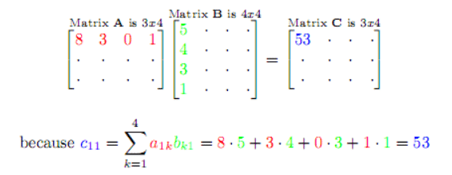
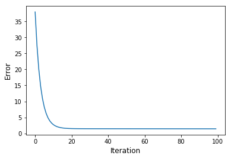
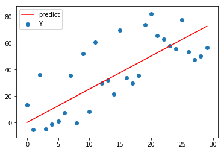

***
## Before we start

Let's check how does matrix dot product work.<br />
We are going to use vectorized computation. Understanding matrix dot product is really important!<br />
I found a good website for visualizing matrix dot product! <a href="http://matrixmultiplication.xyz" target="_blank">Matrix Multiplication</a><br />
I won't talk about "What is Linear Regression" much since there are a lot of good tutorials out there<br />
I highly recommend <a href="https://www.coursera.org/learn/machine-learning" target="_blank">Stanford ML course</a>

***
## Ready to code? Let's begin
Like always, load up all libraries we need first <br />
```python
# Importing libraries we need
%matplotlib inline

#from __future__ import print_function
import numpy as np
import pandas as pd
import matplotlib.pyplot as plt
```

## Create Linear Regression Model Class.
To make it look cool, I am going to build a “Class” of Linear Regression Model,<br>
so we can use our code like we do with tensorflow/scikit-learn library 🙂

```python
class LinearRegression(object):
    def __init__(self):
        self.m = None
        self.b = None
        self.loss_history = []

    def predict(self, X):
        y_pred = np.zeros(X.shape[0])
        y_pred = np.dot(X, self.m) + self.b
        return y_pred
# Calculate 'y_predict' value using matrix multiplcation
```

```python
    def loss(self, X, y):
        y_pred = self.predict(X)
        loss = sum(y - y_pred)/len(y)
        return loss
# loss = Average of errors (y - y-prediction)
```
```python
    def gradient(self, X, y):
        y_pred = self.predict(X)
        b_grad = sum((y_pred - y)) / len(y)
        m_grad = np.dot(X.T, (y_pred - y)) / len(y)
        return b_grad, m_grad

# This part can be bit tricky
    # b_grad :derivative of bias(y-intercept)
    # m_grad : derivative of weight
```

```python
    def train(self, X, y, learning_rate=1e-3, num_iters=100, verbose=False):
        # set a default value of learning rate, and number of iteration
        [num_train, dim] = X.shape
        if self.m is None:
            self.m = 0.001 * np.random.randn(dim, 1)
        if self.b is None:
            self.b = 0.001 * np.random.randn(1)

        for it in range(num_iters):
            # store the loss for each iteration for plot 
            this_loss = self.loss(X, y)
            self.loss_history.append(this_loss)
            # calculates gradient and updates
            [b_gred, m_gred] = self.gradient(X, y)
            # update weights
            self.b -= learning_rate * b_gred
            self.m -= learning_rate * m_gred
            if verbose and it % 10 ==0:
                print('iteration %d / %d: loss %f' %(it, num_iters, this_loss))
```

***

## Let's check if our code works with sample data.
Before you test the code with real data, it is a good idea to test it with small/simple data

```python
# We are expecting the result model with similar weight & bias with this
m = 2.5
b = 5
X = np.arange(30).reshape(30,1)
error = np.random.uniform(-30, 30, size=30).reshape(30,1)
y = (np.dot(m,X) + b) + error
```
### Create Linear Regression model, and train model with data set.

```python
model = LinearRegression()
model.train(X, y, num_iters= 100, verbose=True)
```
    Result will be...
    iteration 0 / 100: loss 37.954977
    iteration 10 / 100: loss 2.723276
        .
        .
    iteration 80 / 100: loss 1.438623
    iteration 90 / 100: loss 1.434857

### Check the result!
```python
plt.plot(model.loss_history)
plt.xlabel('Iteration', fontsize=12)
plt.ylabel('Error', fontsize=12)
    # Let's plot our prediction line
y_pred = np.dot(X, model.m) + model.b
plt.plot(X, y_pred, color='red', label='predict')
plt.scatter(X, y, label='Y')
plt.legend()
plt.show()
```
<figure class="half">


</figure>

***

I hope you liked this post. 
It is true you can build a model faster and easier with library(tensorflow, scikit-learn ..)<br />
But coding up the machine learning algorithm from scratch will give you deeper understanding of it!<br />
I will post about <b>Neural Network</b> next !

