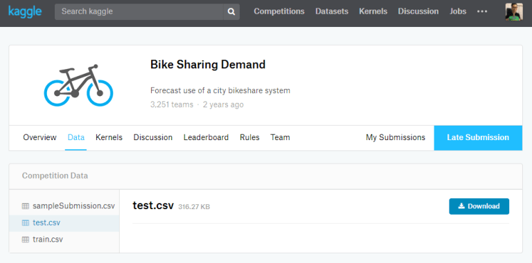
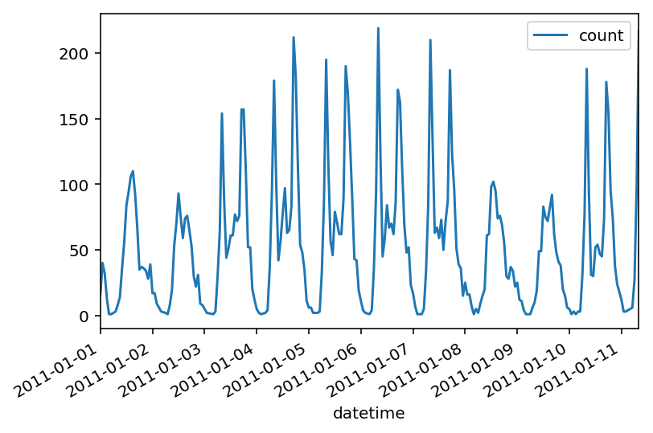

## Before we start.. 

In this post, I am going to show you how to implement Neural Network in python.
But I won't talk about "What is Neural Network" or "How does it work?" here <br />
There are a lot of <a href="https://www.youtube.com/watch?v=aircAruvnKk" target="_blank">Youtube</a> videos and <a href="https://www.coursera.org/learn/machine-learning" target="_blank">Courses</a> out there.<br />

I am going to use <a href="https://www.kaggle.com/c/bike-sharing-demand" target="_blank"><b>Bike-Sharing-Demand</b></a> data from Kaggle
 

***

## Data preparation
### Importing libraries
```python
%matplotlib inline
%config InlineBackend.figure_format = 'retina'
import numpy as np
import pandas as pd
import matplotlib.pyplot as plt
from sklearn.model_selection import train_test_split
```

### Qucik look on data set
```python
import datetime
# Quick look
rides=pd.read_csv('data/train.csv')
# Extract 'month' and 'hour' features from 'datetime'
rides.datetime = rides.datetime.apply(pd.to_datetime)
rides['month'] = rides.datetime.apply(lambda x: x.month)
rides['hour'] = rides.datetime.apply(lambda x : x.hour)
rides.head()

# First 30 days
rides[:24*10].plot(x='datetime', y='count')
```




***

### One Hot Encoding
<b>One Hot Encoding</b> is a process of converting categorical variable into numerical variable<br />
For example, we have 'season' field (spring, summer, fall, winter)<br />
The data point with <b>spring</b> will be converted to [<b>1</b>, 0, 0, 0], <br />
and the data point with <b>fall</b> will be [0, 0, <b>1</b>, 0].

```python
# I am using pandas library
dummy_fields = ['season', 'weather', 'workingday', 'holiday', 'hour', 'month']
for field in dummy_fields:
    dummy = pd.get_dummies(rides[field], prefix=field, drop_first=False)
    rides = pd.concat([rides, dummy], axis=1)

# Drop off fields converted into numerical value, and fields we don't want
drop_fields = ['datetime', 'season', 'weather', 'workingday', 'holiday', 'registered', 'casual', 'atemp', 'hour', 'month']
data = rides.drop(drop_fields, axis=1)
print (data.columns)
```

    Index(['temp', 'humidity', 'windspeed', 'count', 'season_1', 'season_2',
           'season_3', 'season_4', 'weather_1', 'weather_2', 'weather_3',
           'weather_4', 'workingday_0', 'workingday_1', 'holiday_0', 'holiday_1',
           'hour_0', 'hour_1', 'hour_2', 'hour_3', 'hour_4', 'hour_5', 'hour_6',
           'hour_7', 'hour_8', 'hour_9', 'hour_10', 'hour_11', 'hour_12',
           'hour_13', 'hour_14', 'hour_15', 'hour_16', 'hour_17', 'hour_18',
           'hour_19', 'hour_20', 'hour_21', 'hour_22', 'hour_23', 'month_1',
           'month_2', 'month_3', 'month_4', 'month_5', 'month_6', 'month_7',
           'month_8', 'month_9', 'month_10', 'month_11', 'month_12'],
          dtype='object')

***

### Normalize data
To get a higher accuracy, we need to normalized fields with continous variable. <br />
That is, each continous variable fields will have zero mean and standard deviation of 1

```python
quant_features = ['count', 'temp', 'humidity', 'windspeed']
# We will need this mean/std for later !
# store scalings in a dictionary
scaled_features = {}
for each in quant_features:
    mean, std = data[each].mean(), data[each].std()
    scaled_features[each] = [mean, std]
    data.loc[:, each] = (data[each] - mean)/std
```

### Suffle / Split data
Suffling data is important, it helps avoiding biased data.
(There are some data set ordered by certain field)

```python
# Suffle / Split data
[train, valid] = train_test_split(data, test_size = 0.10)

# Seperate data into inputs(features) and output(target)
train_inputs, train_outputs = train.drop('count', axis=1), train['count']
valid_inputs, valid_outputs = valid.drop('count', axis=1), valid['count']

print ("Train Inputs: {}\t Train Outputs: {}".format(train_inputs.shape, train_outputs.shape))
print ("Valid Inputs: {}\t Valid Outputs: {}".format(valid_inputs.shape, valid_outputs.shape))
```

    Train Inputs: (9797, 51)	 Train Outputs: (9797,)
    Valid Inputs: (1089, 51)	 Valid Outputs: (1089,)

*** 

## Build Neural Network from Scratch !
You definitely will need to understand <b>How Neural Network Works</b> before the implemtation.<br />
if you are having a hard time implementing, try to check my other post about <b><a href="https://taigi0315.github.io//building-regression-model/" target="_blank">Linear Regression</a></b>

```python
class NeuralNetwork(object):
    # Define structure of NN, create placeholders
    def __init__(self, input_nodes, hidden_nodes, output_nodes, learning_rate):
        # Setting number of nodes
        self.input_nodes = input_nodes
        self.hidden_nodes = hidden_nodes
        self.output_nodes = output_nodes
        self.learning_rate = learning_rate
        
        # Setting initial weights
        #np.random.normal(mean, sd, size)
        self.weights_input_hidden = np.random.normal(0.0,
                                                     self.input_nodes ** -0.5,
                                                    (self.input_nodes,self.hidden_nodes))
        self.weights_hidden_output = np.random.normal(0.0,
                                                     self.hidden_nodes ** -0.5,
                                                    (self.hidden_nodes,self.output_nodes))
        # sigmoid function
        self.sigmoid = lambda x : 1 / (1 + np.exp(-x))
    
    # Forward pass / Backward pass / Weights updates
    def train(self, features, targets):
        n_records = features.shape[0]
        # Set placeholder for weight changes
        delta_weights_input_hidden = np.zeros(self.weights_input_hidden.shape)
        delta_weights_hidden_output = np.zeros(self.weights_hidden_output.shape)
        
        # Forward/Backward pass for each records
        for X, y in zip(features, targets):
            ## Forward pass - input-hidden
            hidden_inputs = np.dot(X, self.weights_input_hidden)
            hidden_outputs = self.sigmoid(hidden_inputs)
            
            ## Forward pass - hidden-output
            outputs= np.dot(hidden_outputs, self.weights_hidden_output)
            
            ## Backward pass
            #  Caclulate error on each layers
            error = y - outputs
            hidden_error = np.dot(self.weights_hidden_output, error)
            
            # Calculate errors_term for each layer
            output_error_term = error # derivative of 'f(x) = x' is '1'
            # The node in hidden layer with bigger weights has bigger "impact" on output 
            # which means has bigger contribution on "error"
            hidden_error_term = hidden_error * hidden_outputs * (1 - hidden_outputs)
            
            ## stack the weight steps 
            delta_weights_input_hidden += hidden_error_term * X[:, None]
            delta_weights_hidden_output += output_error_term * hidden_outputs[:, None]
        
        # Gradient descent, update weights
        self.weights_input_hidden += self.learning_rate * delta_weights_input_hidden / n_records
        self.weights_hidden_output += self.learning_rate * delta_weights_hidden_output / n_records
    
    # Returns prediction using input
    def run(self, features):
        # Run forward pass, returns predict y value 
        hidden_inputs = np.dot(features, self.weights_input_hidden)
        hidden_outputs = self.sigmoid(hidden_inputs)
        
        outputs = np.dot(hidden_outputs, self.weights_hidden_output)
        return outputs                                                     

# Returns 'Mean Squared Error'
def MSE(y, Y):
    return np.mean((y-Y)**2)
```

***

## Finishing
Let's wrap it up here. I know this post isn't that long, but it actually has a lot of information.(Will require long enough time for who trying to follow it.)<br />

On next post I will show you 
* How to train the model we built
* Check the result with actual value using plot
* Submit the result on Kaggle

***


