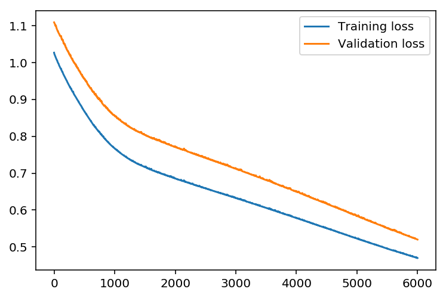
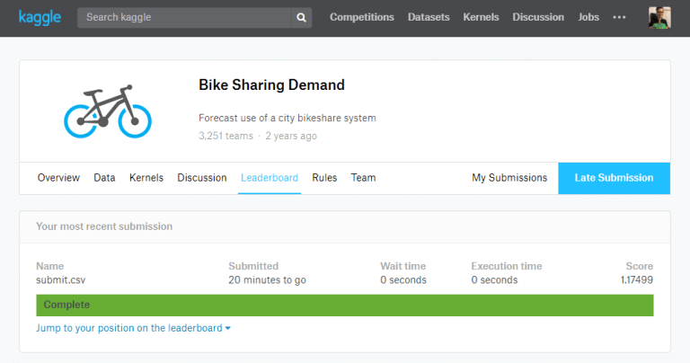
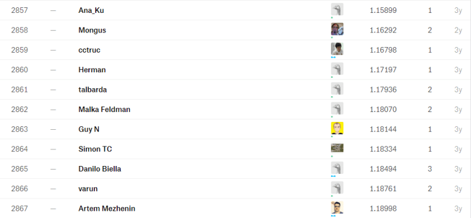

<center><b><a href="https://github.com/taigi0315/chois-ml-note/tree/master/Bike-Sharing_NN" target="_blank"><font size="4">Git Repo Link</font></a></b></center>

# Before we start
## here is more information about "How to train network" from Udacity
###Training the network
The strategy here is to find hyperparameters such that the error on the training set is low, but you’re not overfitting to the data. If you train the network too long or have too many hidden nodes, it can become overly specific to the training set and will fail to generalize to the validation set. That is, the loss on the validation set will start increasing as the training set loss drops.

You’ll also be using a method know as Stochastic Gradient Descent (SGD) to train the network. The idea is that for each training pass, you grab a random sample of the data instead of using the whole data set. You use many more training passes than with normal gradient descent, but each pass is much faster. This ends up training the network more efficiently. You’ll learn more about SGD later.

### Choose the number of iterations
This is the number of batches of samples from the training data we’ll use to train the network. The more iterations you use, the better the model will fit the data. However, if you use too many iterations, then the model with not generalize well to other data, this is called overfitting. You want to find a number here where the network has a low training loss, and the validation loss is at a minimum. As you start overfitting, you’ll see the training loss continue to decrease while the validation loss starts to increase.

### Choose the learning rate
This scales the size of weight updates. If this is too big, the weights tend to explode and the network fails to fit the data. Normally a good choice to start at is 0.1; however, if you effectively divide the learning rate by n_records, try starting out with a learning rate of 1. In either case, if the network has problems fitting the data, try reducing the learning rate. Note that the lower the learning rate, the smaller the steps are in the weight updates and the longer it takes for the neural network to converge.

### Choose the number of hidden nodes
The more hidden nodes you have, the more accurate predictions the model will make. Try a few different numbers and see how it affects the performance. You can look at the losses dictionary for a metric of the network performance. If the number of hidden units is too low, then the model won’t have enough space to learn and if it is too high there are too many options for the direction that the learning can take. The trick here is to find the right balance in number of hidden units you choose.

***

## Training the NN model / Check the result
### You can find play around with hyperparameters to find the best one
```python
import sys

# Set the hyperparameters
iterations = 6000
learning_rate =  0.01
hidden_nodes = 32
output_nodes = 1

input_nodes = train_inputs.shape[1]
network = NeuralNetwork(input_nodes, hidden_nodes, output_nodes, learning_rate)

losses = {'train':[], 'validation':[]}
for ii in range(iterations):
    # Go through a random batch of 128 records from the training data set
    batch = np.random.choice(train_inputs.index, size=128)
    X, y = train_inputs.loc[batch].values, train_outputs.loc[batch]
                             
    network.train(X, y)
    
    # Printing out the training progress
    train_loss = MSE(network.run(train_inputs).T, train_outputs.values)
    val_loss = MSE(network.run(valid_inputs).T, valid_outputs.values)
    sys.stdout.write("\rProgress: {:2.1f}".format(100 * ii/float(iterations)) \
                     + "% ... Training loss: " + str(train_loss)[:5] \
                     + " ... Validation loss: " + str(val_loss)[:5])
    sys.stdout.flush()
    
    losses['train'].append(train_loss)
    losses['validation'].append(val_loss)
```

    Progress: 100.0% ... Training loss: 0.470 ... Validation loss: 0.519

## Let's see how does our model's prediction look like.

```python
plt.plot(losses['train'], label='Training loss')
plt.plot(losses['validation'], label='Validation loss')
plt.legend()
_ = plt.ylim()
```



## Compare first 150 predictions with actual value.

```python
fig, ax = plt.subplots(figsize=(12,6))
mean, std = scaled_features['count']
predictions = network.run(valid_inputs).T*std + mean
ax.plot(predictions[0][:150], label='Prediction')
ax.plot((valid_outputs*std + mean).values[:150], label='Data')
ax.set_xlim(right=len(predictions))
ax.legend()

dates = pd.to_datetime(rides.loc[valid_outputs.index[:150]]['datetime'])
dates = dates.apply(lambda d: d.strftime('%b %d'))
ax.set_xticks(np.arange(len(dates))[12::24])
_ = ax.set_xticklabels(dates[12::24], rotation=45)
```


## Result looks good !
x-axis seems bit odd,  it is because we shuffle the data when we split data into  train/valid sets

***

## Actual prediction on 'Test' data set using the model we trained & submit on Kaggle
We are going to do exactly same data-prep we did on part_1 with 'Test' data 

```python
# load test data
test = pd.read_csv('data/test.csv')
```

```python
# extract month, and hour features from datetime
test.datetime = test.datetime.apply(pd.to_datetime)
test['month'] = test.datetime.apply(lambda x: x.month)
test['hour'] = test.datetime.apply(lambda x : x.hour)
```

```python
# Apply One-Hot-Encoding
dummy_fields = ['season', 'weather', 'workingday', 'holiday', 'hour', 'month']
for field in dummy_fields:
    dummy = pd.get_dummies(test[field], prefix=field, drop_first=False)
    test = pd.concat([test, dummy], axis=1)
# Drop the fields we don't need
drop_fields = ['datetime', 'season', 'weather', 'workingday', 'holiday', 'atemp', 'hour', 'month']
test = test.drop(drop_fields, axis=1)
```

```python
# Normalize continuous variable
# Remember, we use mean/std from 'Train' data, not 'Test' data
test_quant_features = ['temp', 'humidity', 'windspeed']
for each in test_quant_features:
    mean, std = scaled_features[each]
    test.loc[:, each] = (test[each] - mean)/std
```

```python
# Calculate Prediction using 'Test' data
mean, std = scaled_features['count']
test_predict = network.run(test).T*std + mean
```

```python
submit = pd.read_csv('data/test.csv')
submit['count'] = test_predict.T
submit = submit[['datetime', 'count']]
# There are some negative prediction values which Kaggle does not accept as prediction 
# We will replace those with zeros
submit['count'].loc[submit['count'] < 0] = 0
# Save the result as csv file
submit.to_csv('submit.csv', index=False)
```

***

## Alright, ready to submit !
Go to Kaggle, and find Bike Sharing Demand data.<br />
Click Late Submission, and upload your submit.csv file.<br />
The score is not high, but it is with simple NN model we built from scrach ! 



***

## Finishing .. 
Kaggle is really good website for Data science/Machine Learning.<br />
There are a lot of real world data sets, and you can learn from the kernels people shared.
Like always, I hope this post will be helpful for you!

