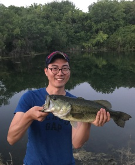

***

## Certifications
<a href="https://www.coursera.org/account/accomplishments/certificate/ZUNWZCMRTB2L" target="_blank">Machine Learning by Stanford University on Coursera</a> 
<a href="https://www.coursera.org/account/accomplishments/certificate/JRF7B8CCNJV2" target="_blank">Machine Learning Foundations: A Case Study Approach by University of Washington on Coursera</a> 
<a href="https://www.coursera.org/account/accomplishments/certificate/K7QDBL3UL65S" target="_blank">Machine Learning: Regression by University of Washington on Coursera</a> 
<a href="https://www.coursera.org/account/accomplishments/certificate/535YR6P76F56" target="_blank">Machine Learning: Classification by University of Washington on Courser</a> 
<a href="https://www.coursera.org/account/accomplishments/certificate/2XVVP37SKFCC" target="_blank">Machine Learning: Clustering & Retrieval by University of Washington on Coursera</a> 
<a href="https://confirm.udacity.com/QPDRDCNC" target="_blank">Deep Learning Nano Degree on Udacity</a> 
<a href="https://www.coursera.org/account/accomplishments/certificate/2FGSFJQ9EYFN" target="_blank">Programming for Everybody by University of Michigan on Coursera</a> 
<a href="https://www.coursera.org/account/accomplishments/certificate/Z2N6JADQK52C" target="_blank">Python Data Structures by University of Michigan on Coursera</a> 

## About Me
I am Korean🇰🇷 slightly seasoned with Mexican culture 🇲🇽 
Crazy Creative Mind 🌀 
Machine Learning Lover 🤖 
Software Developer at IBM 👁️🐝Ⓜ️   
Master of Teemo 🐿️  
Love fishing 🎣

***
